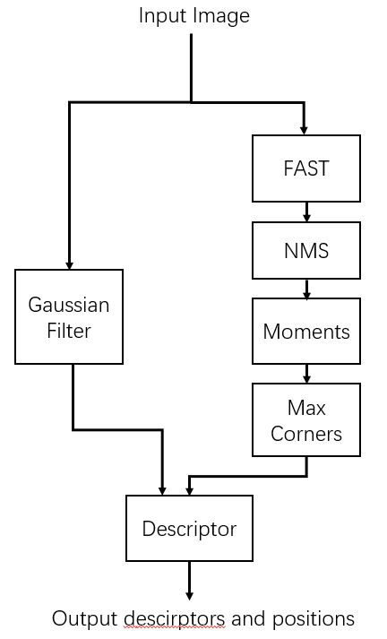
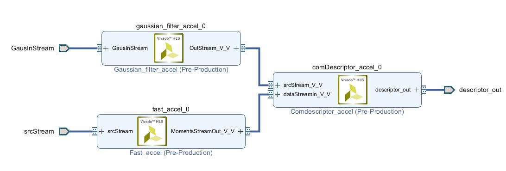
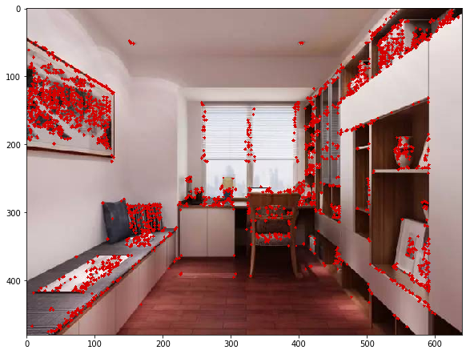

## Introduction
This project implements a ORB feature extractor accelerator on FPGA (on PYNQ-Z2 board).ORB feature is a kind of image feature based on oriented FAST feature and BRIEF descriptor. It's used in feature mapping of some famous work such as ORB-SLAM.Here is a brief explanation of how ORB Features are extracted.  
<div align=center>

</div>  

The extractor will take a gray image and applys a FAST extractor on it. After feature points being found, it will calculate m01 and m10 moment of the feature points and figure out the angle of them. Calculating BRIEF descriptors needs the angle and a gray image which is the original gray image applied a 7x7 gaussian filter.  
  
## Result  
### 1.Resource Utilizaton (on Pynq-Z2)
| Resource | Utilization | Available | Utilization |
| :------: | :---------: | :-------: | :---------: |
|   LUT    |    35807    |   53200   |    67.31    |
|  LUTRAM  |    1412     |   17400   |    8.11     |
|    FF    |    54895    |  106400   |    51.59    |
| BRAM18K  |     50      |    140    |    35.71    |
|   DSP    |     24      |    220    |    10.91    |

### 2.Performance (testing on images in 640*480)
|   Platform    | Average Delay | Throughoutput |
| :-----------: | :-----------: | :-----------: |
| PS 650mHz -O  |   291.7 ms    |   3.43 FPS    |
| PS 650mHz -O2 |    98.5 ms    |   10.20 FPS   |
|   PL 140mHz   |   17.56 ms    |   56.96 FPS   |

### 3. Result Picture
  
Feature points are drawn on the picture.Descriptors can be read in the buffer filled by DMA.
## Quick Start
Run these command lines on your Pynq-Z2 Board (tested on v2.4):
```
sudo pip3 install git+https://github.com/Siudya/ORB_FPGA.git
```
## Contents of each folder
### ip
HLS sources files 
### pynq_arch
Vivado project
### pynq_notebook
Notebook run in Jupyter Notebook
### soft_ware_test
A .cpp file that test the same process on CPU 
### test_data
Images for testing
### hw
.bit and .hwh files for PYNQ  

## How to rebuild Vivado project
**vivado 2018.3** is required.  

### Step 1: rebuild HLS IP
Open **Vivado HLS** command terminal and run these commands :  
```
cd <path-to-proj>/ip
vivado_hls -f build_ip.tcl
```  
This should take about half an hour.
### Step 2: rebuild top project
Open **Vivado** command terminal and run these commands :  
```
cd <path-to-proj>/pynq_arch
source pynq_arch.tcl
```
